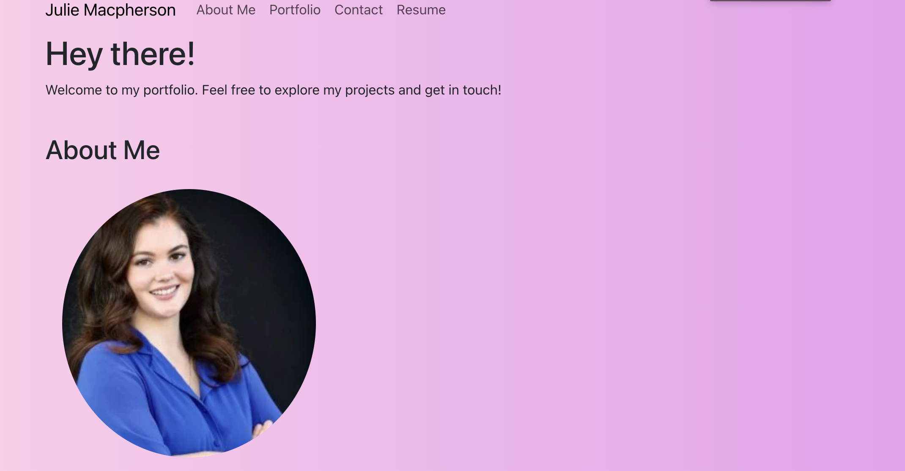

# My React Portfolio

## Description

This project was to create React a portfolio page to show to potential employers my previous work. It features my name, a photo of myself, an about me section, my previous work, and ways to contact me.

## Installation

No installation required - [Click here](https://julies-react-portfolio-a4098a663fdf.herokuapp.com/) to view the deployed webpage

## Usage

To navigate the webpage, refer to the navigation bar at the top of the page. There you will find links that take you to different sections of the page, including the About Me, Portfilio, and Contact Information. Included in the Portfolio section, you will find photo links that take you to deployed webpages and the Github repositories. In the Contact section, you will a form you can fill out to contact me.

## Credits

[julie-mac](https://github.com/julie-mac)

## License

Please refer to the LICENSE in the repository.